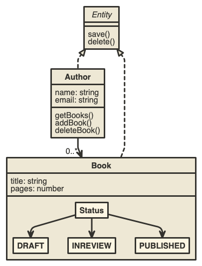

# Micro Frontends & Services

```yaml
by: иÐгü
email: ndru@chimpwizard.com
date: 11.14.2018
version: conception
```

****

The goal of this POC is create an application using micro front end and micro services using containers.

## Proposed Design

Microservices has been very popular, what usually happens is that you have a nice microservice architecture on the back end unsing technologies like kubernetes or docekr swarm but the front end become a monolithic appproach. The goals of microservices is to faciliate agine development and continuos deployment, the idea is to make sure you can do the same across all the layers on your application.

### The pronblem

For the purpose of this POC we will use angular7/elements which is an implementation of webcomponents and nodejs on the back end to build a simple application.

The application mode is represented by the following diagram.



### Breakingdown the pices

### The architecture

### to run

```shell
npm run provision
npm run build
npm run deploy
```

## Some references while doing this

- https://microservices.io/
- https://micro-frontends.org/
- https://medium.com/@gilfink/why-im-betting-on-web-components-and-you-should-think-about-using-them-too-8629396e27a
- https://medium.com/@tomsoderlund/micro-frontends-a-microservice-approach-to-front-end-web-development-f325ebdadc16
- https://www.softwarearchitekt.at/post/2018/05/04/microservice-clients-with-web-components-using-angular-elements-dreams-of-the-near-future.aspx
- https://domainlanguage.com/ddd/
- https://martinfowler.com/bliki/BoundedContext.html


## Additional improvements

- xxx