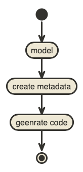
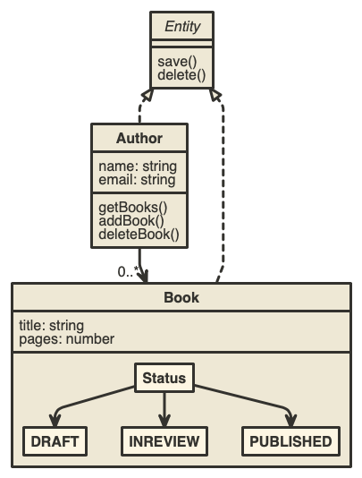

# Code generation with JISON using DDD techniques

```yaml
by: иÐгü
email: ndru@chimpwizard.com
date: 11.11.2018
version: draft
```

****

Methaprograming is for lazy coders, as a great coders the goal is to produce the best functionality with less typing, so if you have the same opinion methaprograming is  dedicated to achieve that.

This POC goal is to define a grammar to create a model definition language that will allow latter on to generate code.

## Proposed Design

The domain definition language will allow to define domain entities and its relationships, as well as some additional behaviour then that will be paerser and translated into a JSON file that can be use as a metadata to a generator code. 



## The implementation

The implementation will be in typescript and as a core dependency we will use [jison](https://github.com/zaach/jison) package a great package created by [Zach Carter](https://github.com/zaach). People who is familiar with linux [lex anc yacc](https://www.epaperpress.com/lexandyacc/) this is the nodejs version of those legacy frameworks used to define lexicons and create code compilers.

The model will be parsered into a YAML document that can be latter easy to use by a generator to create typescript code.

### The model

The idea is to be able to create a model that is understandable and easy to maintain.
This model is based on [DDD](https://en.wikipedia.org/wiki/Domain-driven_design) principles also using annotations techniques to enrich the model.

We well use this model as a sample:



Here we degine that an **Author** can have several **Books**, both are defined  as **Entity** which is an abstract that define the basic functionality of every **Entity** and a **Book** can also has an **Status** defined by the Book creation lifecycle.

This conceptual model is represented in a language that we defined which is the purpose of the parser to translate into a YAML/data that can be understud easily by a generator as well as for a human.

In the language we can enrish the model adding annotations that will be helful to define what things we would like to generate. For example we want that the two entities expose a REST API as well define some role base authorization to define who and how the entities can be used.

```m3d

//Constants
var EMAIL_MASK = "([a-z]*@[a-z].[a-z])";

//Enumeratins
enum Status {
  DRAFT,
  INREVIEW,
  PUBLISHED
}

@Auth(roles="*", action="*", access="restrict")
@Route(path="/books", type="CRUD")
@Route(path="/authors/:author/books/:book", type="CRUD")
entity Book {
  title String required;
  pages Number min(1) max(1000);
  status Status;
}

@Auth(roles="*", action="*", access="restrict")
@Route(path="/authors", type="CRUD")
entity Author {
  name String required;
  email String "${EMAIL_MASK}";
}

@Route(path="/authors/:author/books", type="CRUD")
relationship OneToMany {
  Author{book(title)} to Book{editor}
}
```


## Prerequisites to run the code

- install [npm](https://docs.npmjs.com/getting-started/what-is-npm)

### to run

```shell
npm run gen
```

### The parser

The parser will use JISON engine to create a metamodel which is basically translate the domain language into a YAML file that can ge understood by a program.. In this case the generator.

The output of the model will look like this

```yaml
variables:
    DEFAULT_MIN:
        name: DEFAULT_MIN
        value: '1'
    DEFAULT_MAX:
        name: DEFAULT_MAX
        value: '100'
    EMAIL_MASK:
        name: EMAIL_MASK
        value: '([a-z]*@[a-z].[a-z])'
enumertions:
    Status:
        name: Status
        values:
            - DRAFT
            - INREVIEW
            - PUBLISHED
types:
    Address:
        name: Address
        attributes:
            address1:
                name: address1
                type: string
            address2:
                name: address2
                type: string
            city:
                name: city
                type: string
            state:
                name: state
                type: string
            country:
                name: country
                type: string
entities:
    Book:
        name: Book
        is: IEntity
        attributes:
            title:
                name: title
                type: string
                required: true
            pages:
                name: pages
                type: number
                min: '1'
                max: '1000'
            status:
                name: status
                type: Status
        anotations:
            Auth:
                name: Auth
                attributes:
                    properties:
                        name: access
                        value: restrict
            Route:
                name: Route
                attributes:
                    properties:
                        name: handler
                        value: CRUD
        relationships:
            Author-Book:
                from:
                    entity: Author
                    attribute:
                        name: book
                        show: title
                to:
                    entity: Book
                    attribute:
                        name: editor
                type: OneToMany
    Author:
        name: Author
        is: IEntity
        attributes:
            name:
                name: name
                type: string
                required: true
            email:
                name: email
                type: string
                mask: '${EMAIL_MASK}'
            address:
                name: address
                type: Address
        anotations:
            Auth:
                name: Auth
                attributes:
                    properties:
                        name: access
                        value: restrict
            Route:
                name: Route
                attributes:
                    properties:
                        name: handler
                        value: CRUD
        relationships:
            Author-Book:
                from:
                    entity: Author
                    attribute:
                        name: book
                        show: title
                to:
                    entity: Book
                    attribute:
                        name: editor
                type: OneToMany
relationships:
    Author-Book:
        from:
            entity: Author
            attribute:
                name: book
                show: title
        to:
            entity: Book
            attribute:
                name: editor
        type: OneToMany

```

### The generator

At this point we have the model translated into YAML, then the generator will read that model, and create a javascript object from it, then using [Handlebars](https://handlebarsjs.com/) templates will create the code.

In our POC we selected to generate nodejs code and merge that into an angular7 project.

A template to create the enums will look like this

```hbs
{{!-- for each element onthe model --}}
{{#each model.enumertions}}
    {{#if this.name}}
export enum {{this.name}} {
        {{#each this.values}}
            {{#if @last}}
    {{this}}
            {{else}}
    {{this}},
            {{/if}}
        {{/each}}
}
    {{/if}}
{{/each}}
```

and the output of this template + the metadata will be a typescript code like this:

```ts
export enum Status {
    DRAFT,
    INREVIEW,
    PUBLISHED
}
```
Try it out, The full code is on this [repo](https://github.com/chimpwizard/playgound/tree/master/methaprograming/jison) 


## Some references while doing this

- https://github.com/zaach/jison
- https://www.npmjs.com/package/syntax-cli
- https://github.com/antlr/grammars-v4/blob/master/java/Java.g4
- https://docs.oracle.com/javase/specs/jls/se7/html/jls-2.html
- https://www.sitepoint.com/a-beginners-guide-to-handlebars/
- http://khaidoan.wikidot.com/handlebars-helper-advance
- https://github.com/helpers/handlebars-helpers
- https://github.com/angular/in-memory-web-api
- https://chancejs.com/text/word.html
- https://www.npmjs.com/package/Faker
-


## Additional improvements

- Annotatins at attribute level
- Atributes type CUSTOMTYPE
- Anontations @Required, @Range, @Max, @Min, @Mask
- Create domain diagrams using a tool like http://www.nomnoml.com and generate code from its language.
- Improve the data generator using Faker
- Create independent files per component.


<!-- Global site tag (gtag.js) - Google Analytics -->
<script async src="https://www.googletagmanager.com/gtag/js?id=UA-43465642-1"></script>
<script>
  window.dataLayer = window.dataLayer || [];
  function gtag(){dataLayer.push(arguments);}
  gtag('js', new Date());

  gtag('config', 'UA-43465642-1');
</script>